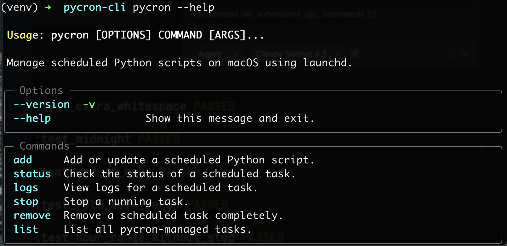

# Pycron CLI

Schedule Python scripts on **macOS** using `launchd` with cron-like syntax.

Perfect for executing **standalone Python scripts** as scheduled tasks on macOS, in a quick and easy way to manage.




> ⚠️ Uses macOS launchd, NOT cron. Accepts a cron-like subset and translates it to launchd.

## Features

- ✅ Cron-like syntax (subset) translated to `launchd`
- ✅ Manage tasks by name (`add`, `status`, `logs`, `list`, `remove`)
- ✅ Persistence across reboots (launchd)
- ✅ Quick access to logs from the CLI
- ✅ Designed for standalone Python scripts (no packaging required)

## Quick Start

```bash
# Every 5 minutes
pycron add --name my-task --py /path/to/script.py --cron "*/5 * * * *"

# Weekdays at 9:00
pycron add --name morning --py /path/to/report.py --cron "0 9 * * 1-5"

# Check status
pycron status --name my-task

# View logs
pycron logs --name my-task

# List all tasks
pycron list

# Remove
pycron remove --name my-task
```

## Installation (dev / local)

Recommended for local development: create a virtual environment inside the repo and install in editable mode.

```bash
cd /path/to/pycron-cli

python3 -m venv .venv
./.venv/bin/python -m pip install -U pip
./.venv/bin/python -m pip install -e .
```

Verify:

```bash
./.venv/bin/pycron --help
```

> Note: `pip install -e .` installs the project in editable mode, so code changes apply without reinstalling.

## Run `pycron` from any directory (no venv activation)

If you don’t want to run `source .venv/bin/activate` every time, create a small wrapper in `~/.local/bin` that points to the venv executable.

### Recommended: wrapper in `~/.local/bin`

1) Create the wrapper:

```bash
mkdir -p ~/.local/bin

cat > ~/.local/bin/pycron <<'EOF'
#!/bin/zsh
exec /ABSOLUTE/PATH/TO/pycron-cli/.venv/bin/pycron "$@"
EOF

chmod +x ~/.local/bin/pycron
```

2) Ensure `~/.local/bin` is in your `PATH` (zsh):

```bash
grep -q 'export PATH="$HOME/.local/bin:$PATH"' ~/.zshrc || echo 'export PATH="$HOME/.local/bin:$PATH"' >> ~/.zshrc
source ~/.zshrc
```

3) Test from anywhere:

```bash
which pycron
pycron --help
```

✅ After this, `pycron` works from **any directory**, without activating the environment.

> Replace `/ABSOLUTE/PATH/TO/pycron-cli` with your real path.  
> Example: `/Users/youruser/Desktop/pycron-cli`

### Why wrapper instead of alias?

An alias only exists in interactive shells and may not work in non-interactive contexts. A wrapper is a real executable and is more reliable.

## Cron Syntax (Subset)

```
┌─────── minute (0-59)
│ ┌───── hour (0-23)  
│ │ ┌─── day of month (must be *)
│ │ │ ┌─ month (must be *)
│ │ │ │ ┌ day of week (0-6, 0=Sun)
* * * * *
```

| Pattern | Example | Description |
|---------|---------|-------------|
| `*/N * * * *` | `*/5 * * * *` | Every N minutes |
| `M H * * *` | `0 9 * * *` | Daily at H:M |
| `M H * * DOW` | `0 9 * * 1-5` | Specific days at H:M |
| `M H1,H2 * * *` | `0 9,18 * * *` | Multiple hours |

**Not supported:** day of month, month, minute ranges, named days, @hourly/@daily.

## Commands

| Command | Description |
|---------|-------------|
| `add` | Add or update a task |
| `status` | Check task status (shows last run time & execution count) |
| `logs` | View task logs |
| `stop` | Stop running task |
| `reload` | Reload registered task |
| `remove` | Remove a task |
| `remove-all` | Remove all tasks |
| `list` | List all tasks |

## Persistence

Tasks are **saved on disk** and will continue to run after your Mac reboots or shuts down. When you restart your machine and log in, all scheduled tasks will automatically resume.

> Note: persistence and “resume” behavior depends on how the job is registered (user vs system context).

## Requirements

- macOS 10.15+
- Python 3.11+

## License

MIT
